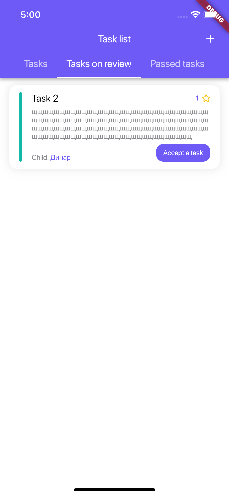
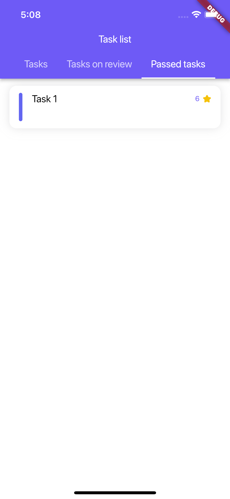

# DreamStar

# 1.0.0 - [APK](https://github.com/DamirNabiull/DreamStar/blob/main/app-release.apk)

## Description
Kids to do list.

Applications for teaching children financial literacy, self-organization, and goal setting. The bottom line is that the child creates a dream. The parent assigns a price to this dream in local currency. The parent also creates tasks for which the child receives currency. This currency can be accumulated and later spent on buying dreams.

## Functionality
1) One feature on the main screen is almost completed 
    - parent can approve tasks and track progress (Parent side)
    - child can complete tasks and submit tasks for verification (Child side)

2) One more screen exists except main screen
    - welcome screen
    - parent can create tasks (seperate screen on Parent side)

3) Application is already reasonable in some way
    - application can be used like ToDo list app

4) Missing network situation is handled
    - when the Internet connection is lost, a screen with a loading indicator appears
    - when the Internet connection appears, the application continues to work in normal mode
    - you can create a task without an Internet connection, it will be cached, and when the Internet appears, it will send to the database

## Code
1) Any networking - Firebase
2) UI files separated from logic files (use Riverpod)

## Advanced
1) Builds successfully for iOS
2) Three screens with some reasonable content
3) Two EditText for text input (task creation screen)
4) Custom theme is applied in Material App
5) Localization
6) Custom app icon

# Screenshots

  
   
   
  
  
  
   
   
  
  
  
   
   
  
  
  
   
   
  
  
  
  

